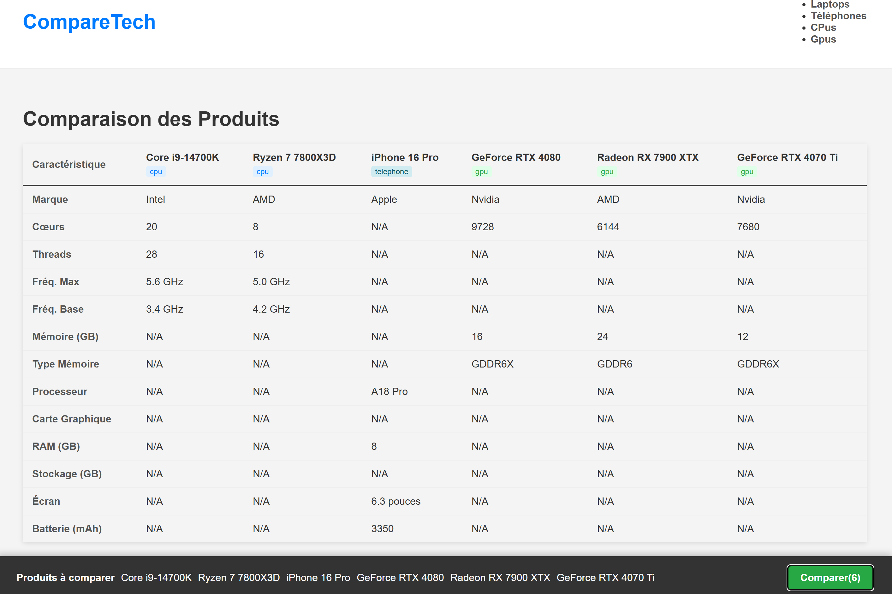

# CompareTech-Comparateur de Hardware Full-Stack(MERN)

#Projet 

compare tech est une application **Full Stack Mern**(MongoDB,Express,React,Node.js) concue pour comparer les 
specifications techniques de materiel informatique(Cpus,Gpus,Laptops,Telephones). L'utilisateur peut filtrer 
les listes, selectionner des articles de differentes categories, et voir un tableau de comparaison cote a cote.

Ce projet a ete construit de A a Z pour demontrer la maitrise de l'architecture MERN et la gestion d'etat complexe
dans une application multi-categories.
**Lien vers le site en direct :
**Lien vers l'API Backend :

##  Fonctionnalités Clés

* **Architecture MERN :** Frontend React et Backend Node.js découplés.
* **API RESTful complète :** Routes pour `GET` (tous/par ID), `POST` (un/plusieurs) pour 4 modèles de données différents.
* **Multi-catégories :** Gère les CPUs, GPUs, Laptops et Téléphones avec des modèles et des routes distincts.
* **Système de Comparaison Global :** L'état de comparaison est géré au niveau `App.jsx` (via `useOutletContext`), permettant de sélectionner un CPU et un GPU et de les comparer sur une page dédiée.
* **Routage Dynamique :** Utilise `react-router-dom` pour les pages de liste (`/gpus`) et de détails (`/cpu/:id`).
* **Filtrage en direct** sur les pages de catégories.

## Technologies Utilisées

### Frontend (Interface)
* **React** (Bibliothèque d'interface utilisateur)
* **React Router** (Pour la navigation multi-pages)
* **React Hooks** (`useState`, `useEffect`, `useOutletContext`)
* **CSS** (Pour le style des composants)

### Backend (Serveur & API)
* **Node.js** (Environnement d'exécution)
* **Express.js** (Framework pour créer l'API RESTful)
* **Mongoose** (Modélisation des données pour MongoDB)
* **CORS** (Pour la communication entre le frontend et le backend)

### Base de Données
* **MongoDB Atlas** (Base de données NoSQL dans le cloud)